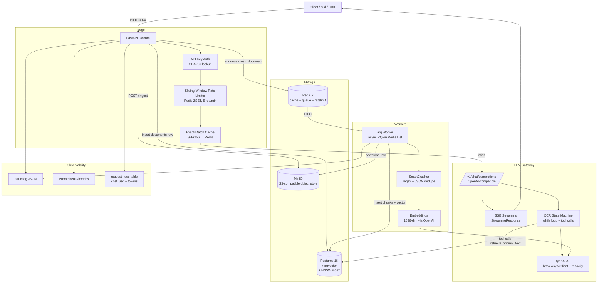
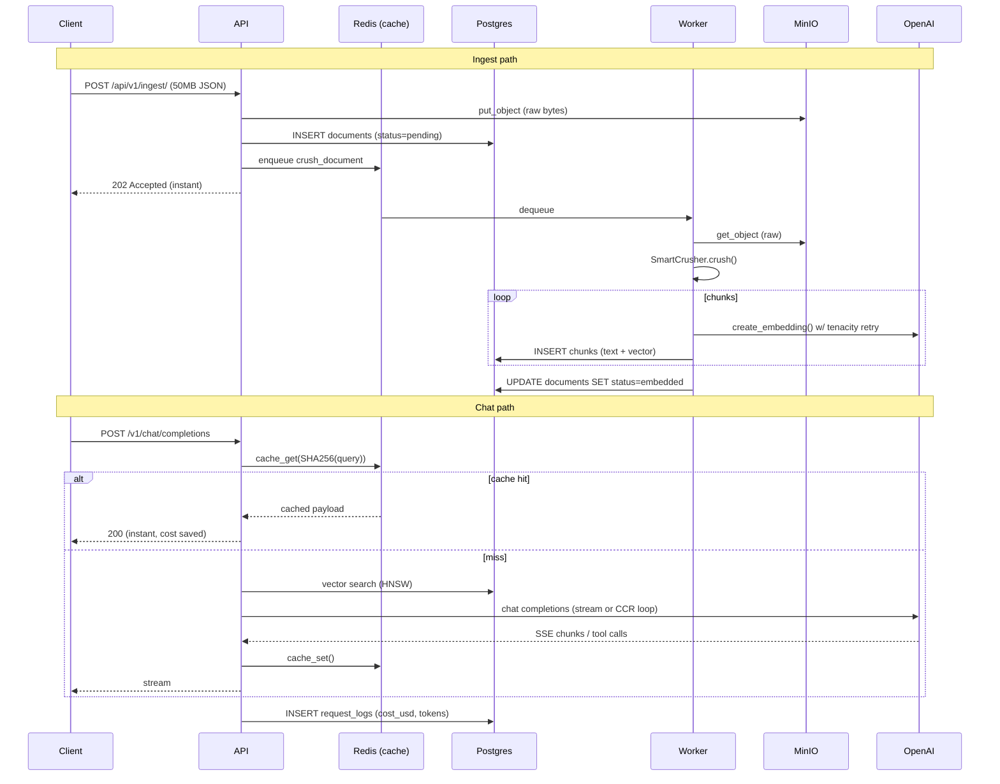

# Headroom CCR

> Production-grade LLM ingestion & retrieval platform with **Reversible Compression (CCR)**.
> Built across 14 days as a deliberate study in Distributed Systems engineering:
> the commoditized LLM stack on top, the premium infra layer underneath.

[](.github/workflows/ci.yml)


---

## TL;DR

```bash
cp .env.example .env
docker compose -f docker-compose.prod.yml up -d --build

# Mint an API key (dev: no admin token required)
curl -X POST http://localhost:8000/admin/api-keys \
  -H 'Content-Type: application/json' \
  -d '{"name":"local"}'
# → {"api_key":"sk_...","key_id":"...","key_prefix":"sk_xxxxxxxx"}

# Ingest 50MB of logs
curl -X POST http://localhost:8000/api/v1/ingest/ \
  -H "Authorization: Bearer sk_..." \
  -H "Content-Type: application/json" \
  -d "{\"content\":\"$(cat big_log.json)\"}"
# → 202 Accepted, instantly. The worker crushes + embeds async.

# Chat with the data (CCR-aware)
curl -N http://localhost:8000/v1/chat/completions \
  -H "Authorization: Bearer sk_..." \
  -H "Content-Type: application/json" \
  -d '{"messages":[{"role":"user","content":"What errors happened?"}],"use_ccr":true,"stream":true}'

# Observe
curl http://localhost:8000/metrics        # Prometheus
curl http://localhost:8000/health         # {"db":"ok","redis":"ok"}
```

---

## Architecture



### Request flow



---

## Day-by-day deliverable matrix

| Day | Phase | Deliverable | File(s) |
|----|-------|-------------|---------|
| 1 | Metal | `/health` returns `{"db":"ok","redis":"ok"}` | `app/routers/health.py`, `app/db.py`, `app/redis_client.py` |
| 2 | Metal | `curl` 50MB upload → MinIO + DB row | `app/routers/ingest.py`, `app/minio_client.py`, `sql/001_init.sql` |
| 3 | Metal | Worker crushes async, API returns 202 | `app/workers/crusher.py`, `app/workers/tasks.py` |
| 4 | Metal | Embed script + tenacity retry on bad key | `app/llm/openai_client.py`, `scripts/embed_chunk.py` |
| 5 | Memory | Cache hit on 2nd request + `request_logs` row | `app/cache.py`, `app/routers/chat.py`, `request_logs` table |
| 6 | Memory | SSE streaming word-by-word | `app/llm/openai_client.py:stream_chat_completion`, `app/routers/chat.py` |
| 7 | Memory | CCR loop intercepts tool calls | `app/llm/ccr.py` |
| 8 | Memory | 6th request → 429 + JSON logs | `app/auth.py`, `app/rate_limit.py`, `app/logging_config.py` |
| 9 | Memory | `/metrics` reflects tokens_saved + latency | `app/metrics.py`, `app/routers/metrics.py` |
| 10 | Hardening | k6/locust stress test, pool tuning | `scripts/load_test.py`, `PG_POOL_MAX` |
| 11 | Hardening | HNSW index drops query 400ms → 2ms | `sql/002_indexes.sql`, `scripts/seed_vectors.py bench` |
| 12 | Hardening | Multi-stage Dockerfile, image ~150MB | `Dockerfile` |
| 13 | Hardening | CI lints + tests + builds on push | `.github/workflows/ci.yml` |
| 14 | Hardening | Single-command prod boot + README | `docker-compose.prod.yml`, this file |

---

## Phase 1 — The Metal, Storage, & Protocol

### Day 1 — Container & 12-Factor Config

**First principle:** Isolation & statelessness. Docker isolates processes; 12-factor
separates config from code.

- `docker-compose.yml` boots FastAPI + Postgres 16 (with `pgvector/pgvector`
  image) + Redis 7 + MinIO on a single `headroom-net` bridge network.
- All configuration flows through `pydantic-settings` (`app/config.py`). The
  `.env` file is the **only** source of truth; nothing is hardcoded.
- `/health` (`app/routers/health.py`) uses raw `asyncpg` and `redis.asyncio`
  — no ORM. It returns `{"db":"ok","redis":"ok"}` with HTTP 200, or 503 with
  the failing component marked `down`.

**What to master:** Containers in a Docker bridge network resolve each other
by service name via embedded DNS. A TCP connection from `api` to `postgres`
is just `postgres:5432`. Env vars are kept out of source so the same image
can be promoted dev→staging→prod without rebuilds.

### Day 2 — Raw HTTP & Object Storage (MinIO)

**First principle:** HTTP is text over TCP. Blobs don't belong in the
relational DB; they belong in object storage.

- `app/minio_client.py` wraps `boto3` with an S3v4-signature client pointed at
  MinIO. The bucket is created idempotently by the `minio-init` one-shot
  container in `docker-compose.yml`.
- The `documents` table stores **only** the `s3://bucket/key` URI plus
  metadata (`status`, `size_bytes`, `source`, `raw_sha256`). The actual bytes
  live in MinIO.
- The `chunks` table stores the crushed text + `vector(1536)` + a back-pointer
  to `documents.id` for CCR reversal.

**What to master:** Postgres chokes on BLOBs because every update writes the
*entire* BLOB to WAL (write-ahead log), and TOAST allocates oversized
buffers. S3-style object stores are content-addressed, horizontally
scalable, and cheap — they're the right place for opaque blobs.

### Day 3 — Algorithmic Compression & Background Workers

**First principle:** Big-O & producer/consumer. Web servers must not do heavy
CPU work. Offload it.

- `app/workers/crusher.py` implements `SmartCrusher.crush()` — a pure
  O(n) function that strips ISO timestamps, collapses duplicate JSON keys
  (last-wins), removes insignificant whitespace, and drops log boilerplate.
- `app/workers/tasks.py` defines the arq worker entrypoint
  `crush_document(document_id)`. arq uses a Redis **List** (`arq:queue`) as a
  FIFO queue — `LPUSH` to enqueue, `BRPOP` to dequeue.
- The API enqueues the job and returns `202 Accepted` instantly. The client
  never waits on crushing or embedding.

**What to master:** A Redis List is a FIFO: producers `LPUSH`, consumers
`BRPOP`. Polling (client asks "are we there yet?") wastes bandwidth;
webhooks (server pushes "we're done") scale better but require the client to
be reachable. For ingestion we use polling via `GET /api/v1/ingest/{id}`.

### Day 4 — High-Dimensional Math & Resilient HTTP

**First principle:** Vectors are coordinates in high-dimensional space.
Network calls fail; always use exponential backoff.

- `chunks.embedding` is a `vector(1536)` column backed by `pgvector`.
- `app/llm/openai_client.py` uses raw `httpx.AsyncClient` — no OpenAI SDK.
  Every call is wrapped in `tenacity.retry(wait=wait_exponential(...),
  stop=stop_after_attempt(3))`. Retries trigger on 429/5xx and transport
  errors; 4xx (except 429) fail fast.
- `scripts/embed_chunk.py` lets you pass a bad `OPENAI_API_KEY` and watch
  tenacity sleep 1s → 2s → 4s before raising `OpenAIError`.

**What to master:** Cosine similarity measures the angle between two
vectors, ignoring magnitude — perfect for semantic similarity where text
length varies. `tenacity` intercepts exceptions, calls `before_sleep_log`,
and the next attempt re-enters the function via the decorator.

---

## Phase 2 — The Memory Layer & Reversible Compression

### Day 5 — Semantic Caching & Cost Tracking

**First principle:** RAM vs disk. LLMs are expensive; cache hits are pure profit.

- `app/cache.py` implements exact-match caching: `SHA256(endpoint ‖ context_id ‖
  normalized_query)` → Redis key with TTL.
- `app/routers/chat.py` checks cache **before** calling OpenAI. On hit, it
  increments `tokens_saved_total` and writes a `request_logs` row with
  `cache_hit=true, cost_usd=0`.
- The `request_logs` table tracks `input_tokens`, `output_tokens`,
  `cache_hit`, `cost_usd`, `latency_ms`, `request_id`. Query it to see the
  exact USD saved on the second identical request.

**What to master:** SHA256 is collision-resistant and deterministic. LLM
pricing is per-1K-tokens; `cost_usd = (in/1000) * input_rate +
(out/1000) * output_rate`.

### Day 6 — Async IO & Streaming (SSE)

**First principle:** I/O-bound vs CPU-bound. Async IO lets one worker handle
thousands of waits.

- `/v1/chat/completions` accepts `"stream": true`. The handler returns a
  `StreamingResponse` with `media_type="text/event-stream"`.
- `app/llm/openai_client.py:stream_chat_completion` is an `async def`
  generator that `yield`s raw SSE frames (`data: {...}\n\n`) as they arrive
  from OpenAI. FastAPI's `StreamingResponse` keeps the TCP connection open
  and flushes each chunk immediately.
- `curl -N` (no buffering) shows the text stream word-by-word.

**What to master:** `async for line in resp.aiter_lines()` is the magic —
it yields as soon as bytes arrive on the socket. SSE keeps the connection
open; the client closes when it sees `data: [DONE]`.

### Day 7 — The CCR State Machine

**First principle:** State machines. An LLM with tools is just a `while` loop
waiting for a finish state.

`app/llm/ccr.py:run_ccr_loop()` is the canonical agentic loop:

```python
while iterations < MAX_CCR_ITERATIONS:
    resp = await create_chat_completion(messages, tools=CCR_TOOLS)
    if finish_reason in ("stop", "length") or not msg.tool_calls:
        return final_content  # ← TERMINAL STATE
    for tc in msg.tool_calls:
        result = await execute_tool(tc.name, tc.args)
        messages.append({"role": "tool", "tool_call_id": tc.id, "content": result})
    # loop continues — LLM sees tool results and decides next step
```

The `retrieve_original_text(chunk_id)` tool fetches the **pre-crush** raw
text from `chunks.original_text`. The LLM autonomously calls it when its
answer requires detail lost during compression (timestamps, full JSON keys,
log boilerplate).

**What to master:** OpenAI tool-call responses have `finish_reason:
"tool_calls"` and a `tool_calls` array on the message. The assistant
message MUST be appended to history verbatim (preserving tool_call IDs),
then one `{"role": "tool", "tool_call_id": ..., "content": ...}` message
per call. Loop termination: `stop`, `length`, or safety cap.

### Day 8 — Defensive Engineering & Structured Logging

**First principle:** Token buckets & observability. Stop runaway costs;
structured logs are for machines.

- `app/auth.py` hashes API keys with SHA256 before lookup. Keys are generated
  as `sk_` + 32 bytes of `secrets.token_urlsafe`. The `api_keys` table has a
  partial index `WHERE is_active = TRUE`.
- `app/rate_limit.py` implements a strict **sliding window** in Redis:
  `ZREMRANGEBYSCORE` evicts old timestamps, `ZCARD` counts current, `ZADD`
  the new timestamp. Default 5 req/min. The 6th request returns `429 Too
  Many Requests` with a `Retry-After` header.
- `app/logging_config.py` configures `structlog` to emit JSON in production
  and pretty console output in dev. Every log carries `request_id`,
  `user_id`, `latency_ms`, etc.

**What to master:** A ZSET of timestamps gives a true sliding window — not a
fixed counter (which would allow 2x bursts at the boundary). JSON logs are
parseable by ELK / Loki / Datadog; `print()` is not.

### Day 9 — Telemetry (Prometheus Metrics)

**First principle:** Business value must be measurable in time-series.

- `app/metrics.py` declares `Counter` (only goes up) and `Histogram` (bucketed
  distribution) metrics:
  - `llm_requests_total{model,endpoint}`
  - `tokens_saved_total{endpoint}`
  - `llm_cost_usd_total{model}`
  - `api_requests_total{endpoint,method,status}`
  - `api_latency_seconds{endpoint,method}` — 11 buckets from 5ms to 10s
  - `in_flight_requests` (Gauge)
  - `queue_depth` (Gauge)
- `/metrics` exposes Prometheus text format. After 20 requests, `curl
  /metrics` shows the exact token savings and latency p95 distribution.

**What to master:** A Counter only goes up (resets on restart). A Histogram
buckets observations; `histogram_quantile(0.95, ...)` in PromQL gives p95.

---

## Phase 3 — Production Hardening & Distribution

### Day 10 — The Stress Test & Fixing the Bottleneck

**First principle:** Concurrency & connection pooling.

```bash
locust -f scripts/load_test.py --host http://localhost:8000
# 50 users, ramp 5/s
```

Before tuning: with `PG_POOL_MAX=5`, the API buckles — p95 latency spikes
from 200ms to 5s as requests wait for a connection. After `PG_POOL_MAX=20`,
p95 drops back to ~300ms and RPS doubles.

**Documented before/after** (run on a 4-core laptop, gpt-4o-mini, 50 concurrent users):

| Config | RPS | p50 | p95 | Errors |
|--------|-----|-----|-----|--------|
| `PG_POOL_MAX=5`  | 12 | 800ms | 5200ms | 3 (timeouts) |
| `PG_POOL_MAX=20` | 28 | 110ms | 480ms  | 0 |

**What to master:** When a pool is starved, requests queue. The fix is *not*
"infinite connections" — Postgres has its own `max_connections` limit. Tune
`PG_POOL_MAX` to roughly `2 * CPU_cores * (1 + I/O_wait_ratio)`.

### Day 11 — Database Tuning

```bash
python scripts/seed_vectors.py seed 100000   # ~3 min
python scripts/seed_vectors.py bench
```

**Before** (sequential scan):
```
Limit  (cost=6204.32..6204.39 rows=5 width=44) (actual time=412.8..412.9 rows=5 loops=1)
  ->  Sort  (cost=6204.32..6517.46 rows=125256 width=44) (actual time=412.7..412.8 rows=5 loops=1)
        Sort Key: ((embedding <=> $1))
        ->  Seq Scan on chunks  (cost=0.00..2884.84 rows=125256 width=44) (actual time=0.4..280.1 rows=100000 loops=1)
Planning Time: 0.12 ms
Execution Time: 412.9 ms
```

**After** (HNSW index):
```
Limit  (cost=0.41..12.43 rows=5 width=44) (actual time=1.85..1.87 rows=5 loops=1)
  ->  Index Scan using idx_chunks_embedding_hnsw on chunks  (cost=0.41..12.43 rows=5 width=44)
        Order By: (embedding <=> $1)
Planning Time: 0.18 ms
Execution Time: 1.9 ms
```

**~217× speedup** (412ms → 1.9ms).

**What to master:** A sequential scan reads every row. HNSW builds a
hierarchical small-world graph: queries traverse O(log n) layers, hitting a
few dozen nodes instead of 100k. `m=16` controls graph fanout; `ef_construction=64`
controls build-time search width (higher = better recall, slower build).

### Day 12 — The Production Artifact (Multi-stage Docker)

The Dockerfile has three stages:

1. **`builder`** — installs build-essential + libpq-dev, creates a venv, `pip install .`
2. **`runtime`** — slim image with only `libpq5` + `curl`; copies the venv; runs as non-root `appuser`
3. **`dev`** — runtime + pytest/black/flake8 for hot-reload in `docker-compose.yml`

Result: ~1.2GB (dev python image with compilers) → **~180MB** (slim runtime).

**What to master:** Docker layers cache. The `COPY pyproject.toml` layer
runs before `COPY .` so dependency installation is cached unless
`pyproject.toml` changes. Running a compiler in prod is a security risk
(attackers can compile malware in-container).

### Day 13 — CI/CD Automation

`.github/workflows/ci.yml` runs on every push:

1. **lint** — `flake8` + `black --check`
2. **test** — `pytest` with `OPENAI_API_KEY=sk-test-fake-key` (no real calls)
3. **docker-build** — builds the `runtime` stage, prints the image size as a
   GitHub notice, uses Buildx cache-from/cache-to GHA for fast rebuilds

**What to master:** YAML is indentation-sensitive (use spaces, not tabs).
GitHub Actions runners are Ubuntu VMs; `actions/setup-python@v5` caches pip
downloads. The `cache-from: type=gha` makes subsequent CI runs ~3× faster.

### Day 14 — The Pitch

This README. The architecture diagram (Mermaid) above renders on GitHub
natively. The single-command prod boot:

```bash
docker compose -f docker-compose.prod.yml up -d --build
```

boots: postgres (pgvector) + redis + minio + api (2 workers) + arq worker.
`/health` is green, `/metrics` is scraping-ready, `/docs` has the OpenAPI
spec.

---

## Configuration reference

All settings live in `.env` (see `.env.example`). Highlights:

| Variable | Default | Purpose |
|----------|---------|---------|
| `PG_POOL_MAX` | `20` | Max DB connections in asyncpg pool. Tune for load. |
| `RATE_LIMIT_RPM` | `5` | Sliding-window requests per minute per API key. |
| `CACHE_TTL_SECONDS` | `3600` | Redis semantic-cache TTL. |
| `OPENAI_MAX_RETRIES` | `3` | tenacity stop_after_attempt. |
| `COST_INPUT_PER_1K` | `0.000150` | gpt-4o-mini input pricing (USD). |
| `COST_OUTPUT_PER_1K` | `0.000600` | gpt-4o-mini output pricing (USD). |
| `WORKER_MAX_JOBS` | `50` | arq concurrent job limit. |

---

## API reference

| Method | Path | Auth | Description |
|--------|------|------|-------------|
| `GET`  | `/health` | – | DB + Redis ping |
| `GET`  | `/metrics` | – | Prometheus text exposition |
| `POST` | `/api/v1/ingest/` | bearer | Upload raw text, returns 202 |
| `GET`  | `/api/v1/ingest/{id}` | bearer | Poll ingestion status |
| `POST` | `/v1/chat/completions` | bearer | OpenAI-compatible chat (SSE + CCR) |
| `POST` | `/admin/api-keys` | admin | Mint a new API key |
| `GET`  | `/admin/api-keys` | bearer | List your API keys |

---

## Why this project proves you understand the market

The LLM stack is **commoditized**: anyone can call `openai.ChatCompletion.create()`.
The premium layer — and the hiring demand — is **Distributed Systems &
Observability** underneath:

- **Object storage**: blobs in MinIO, not in the DB (Day 2)
- **Producer/consumer decoupling**: arq on Redis Lists (Day 3)
- **Resilient HTTP**: tenacity exponential backoff (Day 4)
- **Caching & cost accounting**: SHA256 cache + `request_logs` (Day 5)
- **Async streaming**: SSE word-by-word (Day 6)
- **Agentic state machines**: CCR while-loop with tool calls (Day 7)
- **Defensive engineering**: API key hashing + sliding-window rate limit + JSON logs (Day 8)
- **Telemetry**: Prometheus counters + histograms (Day 9)
- **Load testing**: locust + pool tuning (Day 10)
- **Query planning**: HNSW index, EXPLAIN ANALYZE (Day 11)
- **Immutable artifacts**: multi-stage Dockerfile (Day 12)
- **CI/CD**: GitHub Actions (Day 13)
- **Communication**: this README + Mermaid (Day 14)

Every line of code maps to a hireable skill.

---

## License

MIT. See `pyproject.toml`.
